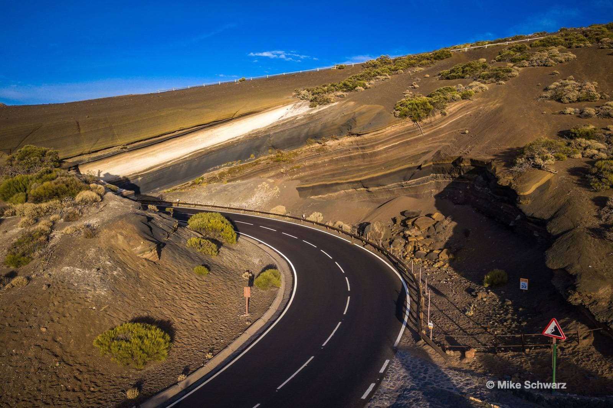

## Начало каждой заметки

Не забудьте добавить YAML в начало:
```
---
title: Инструкция по установке
description: .
tags: 
 - obsidian
layout: layouts/post.njk
---
```

## Ссылки на другие заметки

Скрипт понимает markdown ссылки на другие сайты
[Ссылка на внешний сайт](https://canarit.ru)

```md
[Ссылка на внешний сайт](https://canarit.ru)
```

Или wiki ссылки на внутренние старницы:
```wiki
[[intro|Текст ссылки]]
```

## Изображения
Картинки сохраняются в папке img. Просто перетащите сюда jpg файл, а скрипт сам сделает оптимальные размеры для сайта.



```wiki

```
